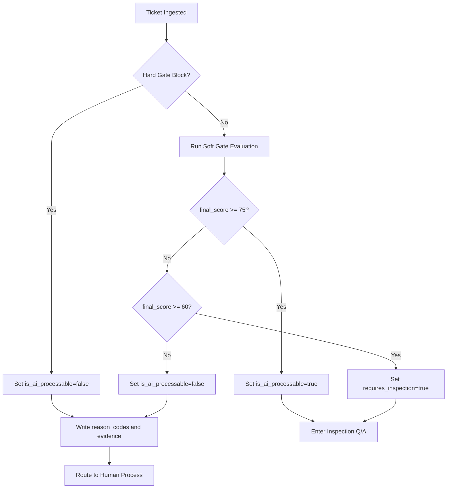

# AI Eligibility Criteria Guide (MVP)

- Date: 2026-03-05
- Scope: Multi-board MVP (GitLab/GitHub/Jira/Focalboard)
- Goal: Consistently decide whether a ticket can enter the AI automation pipeline
- Basis: Extended using the paper *Intelligent AI Delegation* (Tomasev et al., arXiv:2602.11865v1, 2026)

## 1. Why This Document Exists
Automation quality depends on how clearly we separate AI-processable work from human-only work.
This guide defines shared operational rules for `AI eligibility` decisions per ticket.
For system-level context, see [Architecture](./ai-orchestration-architecture.md), [MVP Design](./ai-orchestration-mvp-design.md), and [Ticket Platform Interface](./ticket-platform-interface.md).

## 2. Decision Output Contract
The decision output is fixed to four fields:

1. `is_ai_processable`: `true | false`
2. `decision_confidence`: `high | medium | low`
3. `reason_codes`: array of decision reason codes
4. `requires_inspection`: `true | false` (default `true` in MVP)

## 3. Input Signals
Collect the following ticket context before evaluation:

1. Ticket title/body/comments
2. Labels/tags/custom fields (priority, security, data sensitivity, service impact)
3. Attachment metadata
4. Requested deliverable type (code change, docs, data task, etc.)
5. Required permission level (low-risk/high-risk)

## 3.1 Delegation Dimensions (Paper-Aligned)
In addition to basic metadata, evaluate these delegation dimensions from the paper:

1. `complexity`
2. `criticality`
3. `uncertainty`
4. `cost`
5. `resource_requirements`
6. `constraints` (legal/ethical/operational)
7. `verifiability`
8. `reversibility`
9. `contextuality` (amount/sensitivity of required context)
10. `subjectivity`
11. `autonomy_level` required by execution
12. `monitoring_mode` required (`outcome`, `process`, `continuous`)

These dimensions are used in `Hard Gate`, rule scoring, and inspection routing.

## 3.2 Decision Procedure (Execution Algorithm)
Run this sequence in fixed order:

1. `Input validation`: if title/body/definition of done/requested artifact are missing, set `requires_inspection=true`
2. `Hard Gate`: block policy/security/authority violations
3. `Soft Gate`: run LLM suitability evaluation only if Hard Gate passes
4. `Score merge`: `final_score = 0.6 * rule_score + 0.4 * llm_score`
5. `Decision`: choose `yes`, `inspection`, or `no` using thresholds (75/60)
6. `Decision trace`: store `reason_codes` and evidence sentences
7. `State transition`: move after `TRIAGE_DONE`

Decision pseudocode:
```text
if missing_required_fields:
  return requires_inspection=true, reason=INSUFFICIENT_INPUT

if hard_gate_blocked:
  return is_ai_processable=false, reason=HARD_POLICY_BLOCK

rule_score = run_rule_scoring(ticket)   # includes delegation dimensions
llm_score = run_llm_scoring(ticket)
final_score = 0.6*rule_score + 0.4*llm_score

if final_score >= 75:
  return is_ai_processable=true, requires_inspection=true
if final_score >= 60:
  return is_ai_processable=true, requires_inspection=true, reason=NEEDS_CLARIFICATION
return is_ai_processable=false, reason=LOW_FEASIBILITY
```

## 4. Hard Gate (Rule Engine)
If any condition below is true, skip LLM suitability and return `is_ai_processable=false`.

1. Human-only legal/regulatory authority is required
2. Production-direct or high-risk privilege is required without approved human handoff
3. PII/confidential raw data exposure risk is present without safe handling path
4. Acceptance criteria are undefined or non-measurable
5. External dependency is unknown and cannot be validated
6. High criticality + low reversibility + low verifiability (unsafe triad)
7. Permission scope is over-broad, non-expiring, or not attenuation-safe for sub-delegation
8. Accountability chain is missing for multi-step delegation
9. Security anomaly signal exists (prompt injection, suspicious tool request, exfiltration pattern)

Default reason codes:
1. `HARD_POLICY_BLOCK`
2. `REQUIRES_HUMAN_ONLY_AUTHORITY`
3. `SENSITIVE_DATA_EXPOSURE_RISK`
4. `UNDEFINED_ACCEPTANCE_CRITERIA`
5. `LOW_VERIFIABILITY_HIGH_IMPACT`
6. `PERMISSION_SCOPE_UNSAFE`
7. `ACCOUNTABILITY_CHAIN_GAP`
8. `SECURITY_ANOMALY_DETECTED`

## 5. Soft Gate (LLM Evaluation)
Evaluate only tickets that pass Hard Gate.

Evaluation axes:
1. Clarity: requirements and Definition of Done are explicit
2. Feasibility: executable in the available sandbox/tooling context
3. Risk boundedness: blast radius is limited
4. Verifiability: outcome can be checked automatically or semi-automatically
5. Reversibility: failures can be rolled back safely
6. Context sensitivity: required context can be safely accessed and minimized
7. Autonomy fit: required autonomy level matches current trust level
8. Monitoring readiness: checkpointing/telemetry path is available

Scoring:
1. `rule_score` (0-100): policy and structured risk score
2. `llm_score` (0-100): semantic suitability score
3. `final_score = 0.6 * rule_score + 0.4 * llm_score`

Thresholds:
1. `final_score >= 75`: `is_ai_processable=true`
2. `60 <= final_score < 75`: `is_ai_processable=true`, `requires_inspection=true`
3. `final_score < 60`: `is_ai_processable=false`

## 5.1 Trust and Reputation Calibration
Per the paper, use a distinction between:

1. `reputation`: public/verifiable history of past execution quality
2. `trust`: private, context-dependent acceptance threshold for this task

Operational rule:
1. High trust: outcome-level monitoring may be enough for low-criticality tasks
2. Medium trust: mandatory process checkpoints
3. Low trust or high-criticality task: human-in-the-loop checkpoint before irreversible actions

## 5.2 Permission Handling Baseline
Use risk-adaptive permissions:

1. Low-stakes tasks: standing permissions allowed with least privilege
2. High-stakes tasks: just-in-time scoped permissions with expiry
3. Sub-delegation: permission attenuation is mandatory (never pass full parent authority)
4. Circuit breakers: revoke active permissions if trust drops or anomaly is detected

## 5.3 Verifiable Completion and Liability
Completion is valid only when verification method is defined before execution.

Accepted verification modes:
1. Direct verification (tests/rules/checkers)
2. Trusted third-party audit
3. Cryptographic proof (where available)
4. Multi-agent adjudication/consensus

For delegation chains (`A -> B -> C`):
1. `A` holds `B` accountable by contract
2. `B` holds `C` accountable by sub-contract
3. Signed attestation chain is required for closure

## 5.4 Final Decision Matrix
| Condition | Result | Required Follow-up |
|---|---|---|
| Hard Gate blocked | `is_ai_processable=false` | Route to human queue + persist blocking reasons |
| Hard Gate pass + final_score >= 75 | `is_ai_processable=true` | Start inspection Q/A + approval gate before execution |
| Hard Gate pass + final_score 60-74 | `is_ai_processable=true`, `requires_inspection=true` | Mandatory clarification question set |
| Hard Gate pass + final_score < 60 | `is_ai_processable=false` | Route to human queue + record improvement reasons |

## 5.5 Minimum Inspection Question Set
If `requires_inspection=true`, ask all five:

1. State Definition of Done in one sentence.
2. Specify output format (code/MR/doc/attachment).
3. List allowed systems and prohibited systems.
4. Define acceptable risk and rollback criteria.
5. Confirm deadline and priority.

## 6. Decision Flow (Mermaid)


## 7. Platform Mapping (Labels/Fields/States)
Common rules:
1. Persist decision as `ai-processable`, `ai-inspection-required`, `ai-reason-*`
2. Use `label`, `custom field`, or `comment tag` depending on platform capability

Example mapping:
1. GitLab/GitHub: labels
2. Jira: labels + custom fields
3. Focalboard: card properties/columns/tags

State transitions:
1. After triage: `TRIAGE_PENDING -> TRIAGE_DONE`
2. If `is_ai_processable=true`: enter `INSPECTION_QA`
3. If `is_ai_processable=false`: route to human queue

## 8. Example Scenarios
1. Documentation template drafting
   - Signals: clear input, low risk, high verifiability
   - Result: `is_ai_processable=true`
2. Direct production database mutation
   - Signals: high criticality, low reversibility, high privilege
   - Result: `HARD_POLICY_BLOCK`, `is_ai_processable=false`
3. Feature request with unclear acceptance criteria
   - Signals: high uncertainty, low clarity
   - Result: `requires_inspection=true` or `is_ai_processable=false`

## 9. Operational Metrics
1. Decision precision: post-review misclassification rate
2. Inspection conversion rate: percentage requiring clarification
3. AI completion rate: `% of AI-processable tickets that reach DONE`
4. Escalation rate: `% routed back to humans during execution`
5. Platform variance: misclassification gap across platforms

## 10. Change Management
1. Hard Gate rule changes require security owner approval
2. Threshold changes (75/60) are adjusted via biweekly experiment results
3. New reason codes require synchronized updates to:
   - `ai-orchestration-mvp-design.md`
   - `ai-orchestration-architecture.md`
   - `ticket-platform-interface.md`

## 11. Reference
1. Nenad Tomasev, Matija Franklin, Simon Osindero. *Intelligent AI Delegation*. arXiv:2602.11865v1, published February 12, 2026.
