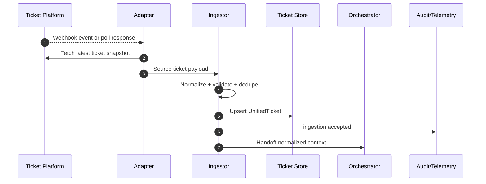

# AI Ticket Ingestion Architecture

- Version: 1.1
- Date: 2026-03-05
- Scope: Ingestor and adapter-level ticket intake for GitLab, GitHub, Jira, Plane, and Focalboard

## 1. Purpose
This document defines how ticket changes are collected from platform APIs and converted into orchestration-ready input.
It expands the ingestion part of [AI Orchestration Architecture](./ai-orchestration-architecture.md).

## 2. What Ingestion Covers
Ingestion starts when a platform change becomes observable and ends when a normalized ticket is handed to orchestrator.

Included:
1. Event collection (`webhook` and `polling`).
2. Platform adapter routing.
3. Normalization and validation.
4. Deduplication and ordering.
5. Persistence and handoff.
6. Audit and monitoring.

Not included:
1. Eligibility scoring.
2. Inspection Q/A strategy.
3. Worker execution internals.

## 3. High-Level Flow
1. Platform emits or exposes ticket updates.
2. Adapter fetches latest ticket snapshot.
3. Ingestor normalizes to `UnifiedTicket`.
4. Ingestor validates, deduplicates, and upserts.
5. Ingestor emits events and hands off to orchestrator.

## 4. Platform Support
Supported platform types:
1. `gitlab`
2. `github`
3. `jira`
4. `plane`
5. `focalboard`

The common adapter contract is defined in [Ticket Platform Interface](./ticket-platform-interface.md).

## 5. Ingestion Modes
### 5.1 Webhook-First
1. Platform sends event to ingest endpoint.
2. Signature/token is validated.
3. Adapter fetches canonical latest snapshot.
4. Snapshot enters normalization pipeline.

### 5.2 Polling Fallback
1. Scheduler calls adapter `listUpdatedTickets(updatedSince, limit)`.
2. Adapter maps platform-native query params and pagination.
3. Cursor/checkpoint is moved only after successful persistence.

## 6. Connection Registry (Ingester Admin Console)
To avoid hardcoded endpoints and credentials, ingestion uses an admin console where multiple platform connections can be registered and managed.

Core capabilities:
1. Register multiple platform connections.
2. Update connection endpoint and path templates.
3. Link authentication by secret reference (`secretRefId`) without exposing raw API keys.
4. Enable/disable connections.
5. Set default and priority when multiple connections match.
6. Test connection and scope before activation.
7. View sync health (last success/error, lag, ingest count).

Required fields:
1. `connectionId`
2. `platformType` (`gitlab|github|jira|plane|focalboard`)
3. `workspaceId`
4. optional `boardId/project/repo`
5. `baseUrl`
6. `authType` (`token|app|oauth`)
7. `secretRefId`
8. `pollingEnabled`
9. `pollingIntervalSec`
10. `webhookEnabled`
11. `status` (`active|paused|disabled`)
12. `priority` (lower is higher priority)
13. `isDefault`

Uniqueness key:
`platformType + workspaceId + baseUrl + optional boardId/project/repo`

Selection rules:
1. Multiple platforms can be active at once.
2. Same platform can have multiple workspace/project connections.
3. Duplicate uniqueness keys are rejected.
4. Only one `isDefault=true` per `(platformType, workspaceId)` scope.
5. If several active connections match, the lowest `priority` wins.
6. If none match, emit `PLATFORM_CONFIG_NOT_FOUND`.

## 7. Routing Rules
Routing key:
1. `platformType`
2. `workspaceId`
3. optional `boardId/project/repo`

Router responsibilities:
1. Resolve adapter and active connection.
2. Apply platform-specific timeout/retry defaults.
3. Emit audit events for every platform read call.

## 8. Normalization Pipeline
1. Collect source fields (`ticketId`, `title`, `description`, labels, assignees, status).
2. Convert to `UnifiedTicket`.
3. Validate required fields (`platform`, `workspaceId`, `ticketId`, `title`).
4. Sanitize text and strip unsafe metadata.
5. Attach ingestion metadata:
   - `ingestedAt`
   - `sourceEventAt`
   - `ingestionMode`
   - `adapterVersion`

On validation failure:
1. Persist rejection reason.
2. Emit `ingestion.validation_failed`.

## 9. Idempotency and Ordering
Primary key:
`platform + workspaceId + ticketId + sourceUpdatedAt`

Rules:
1. Already-processed key -> skip as duplicate.
2. Newer snapshot -> upsert.
3. Older out-of-order snapshot -> drop as stale and audit.

## 10. Persistence and Handoff
1. Upsert normalized ticket snapshot.
2. Link snapshot to orchestration context.
3. Emit `ingestion.accepted`.
4. Hand off to orchestrator for eligibility flow.

Failure handling:
1. Transient API errors -> retry with backoff.
2. Permanent mapping/validation errors -> no retry, escalate.

## 11. Security
1. Ingestion credentials are adapter-scoped and read-only.
2. No raw secret values in tickets, logs, or artifacts.
3. Raw payload logging is masked/sanitized.
4. Every adapter call is traceable with correlation id.

Credential principles follow [Secret Broker Architecture](./secret-broker-architecture.md).

## 12. Observability
Required events:
1. `ingestion.received`
2. `ingestion.normalized`
3. `ingestion.accepted`
4. `ingestion.duplicate_skipped`
5. `ingestion.validation_failed`
6. `ingestion.platform_error`

Required metrics:
1. Ingestion latency (`p50/p95/p99`).
2. Duplicate rate.
3. Validation failure rate by platform.
4. Polling lag.

## 13. Sequence

## 14. Operational Checklist
1. Least-privilege credential scopes are enforced.
2. Retry/backoff per platform is configured.
3. Dedup key behavior is tested.
4. Rejection monitoring dashboard exists.
5. Lag alert threshold is defined.
