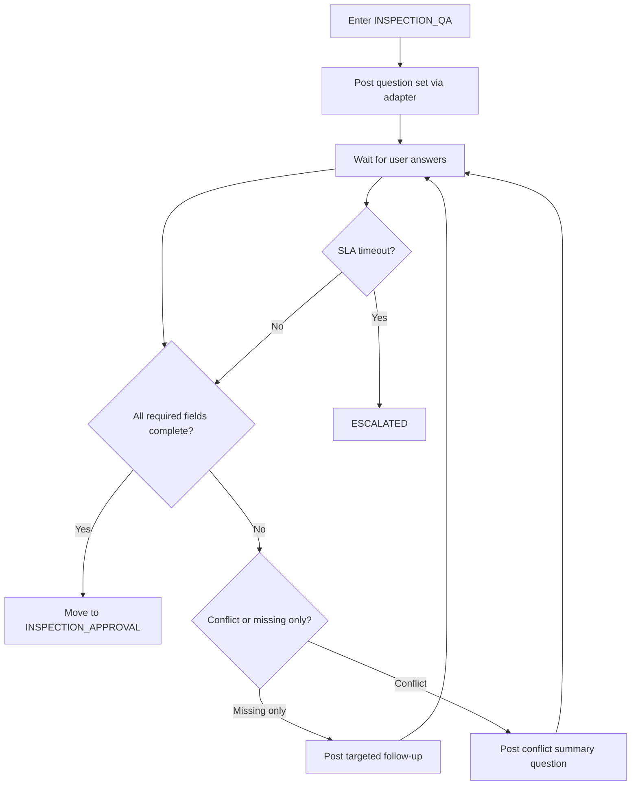

# AI Inspection Q/A Guideline (Handling Missing Information)

- Date: 2026-03-05
- Scope: Multi-board MVP (GitLab/GitHub/Jira/Focalboard)
- Purpose: Enrich incomplete tickets through a structured Q/A loop until they become executable

## 1. When to Start Inspection
Enter `INSPECTION_QA` when any of the following is true:

1. Definition of Done is missing.
2. Output format is unclear (code/MR/doc/attachment).
3. Allowed and prohibited systems are not clearly separated.
4. Priority or due date is missing.
5. Eligibility decision returns `requires_inspection=true`.

References:
1. [AI Eligibility Criteria](./ai-eligibility-criteria.md)
2. [Ticket Platform Interface](./ticket-platform-interface.md)

## 2. Question Generation Rules
Questions must only request information necessary for execution.

1. One question should resolve one decision.
2. Prefer explicit choices or formats over open-ended prompts.
3. Never request raw sensitive secrets.
4. Post at most 5 questions per batch.

Default question set:
1. State the Definition of Done in one sentence.
2. Specify output format (code/MR/doc/attachment).
3. List allowed systems and prohibited systems.
4. Define acceptable risk level and rollback criteria.
5. Confirm priority and deadline.

## 3. Iteration and Exit Conditions
After collecting answers, decide as follows:

1. All required fields complete: `INSPECTION_QA -> INSPECTION_APPROVAL`.
2. Partial gaps remain: ask only targeted follow-up questions and keep `INSPECTION_QA`.
3. Conflicting answers: post a conflict summary and ask 1-2 clarification questions.
4. Prolonged no response: escalate to human queue after SLA timeout.

## 4. State and Marker Operations
Recommended common keys:
1. `ai-inspection-required`
2. `ai-inspection-waiting-user`
3. `ai-inspection-ready-for-approval`
4. `ai-inspection-escalated`

Platform application:
1. Platforms with labels: store as labels.
2. Platforms with custom fields: store as custom fields.
3. Limited platforms: store as comment tags.

State transitions:
1. `TRIAGE_DONE -> INSPECTION_QA`
2. `INSPECTION_QA -> INSPECTION_APPROVAL` (criteria met)
3. `INSPECTION_QA -> ESCALATED` (timeout or unresolved conflict)

## 5. Mermaid Flow

## 6. Operational Metrics
1. Average inspection round-trips.
2. Inspection completion rate (`INSPECTION_QA -> INSPECTION_APPROVAL`).
3. No-response escalation rate.
4. Post-inspection automation success rate.
5. Cross-platform inspection completion variance.
