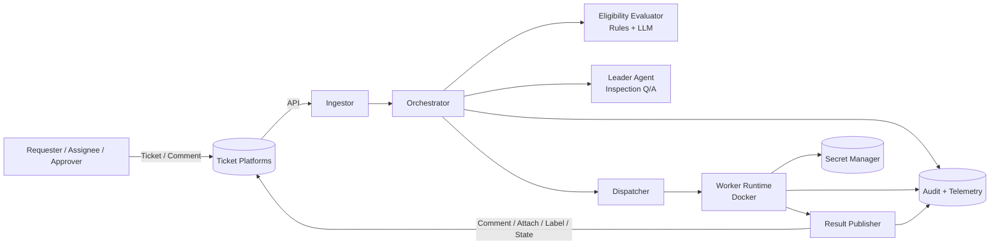
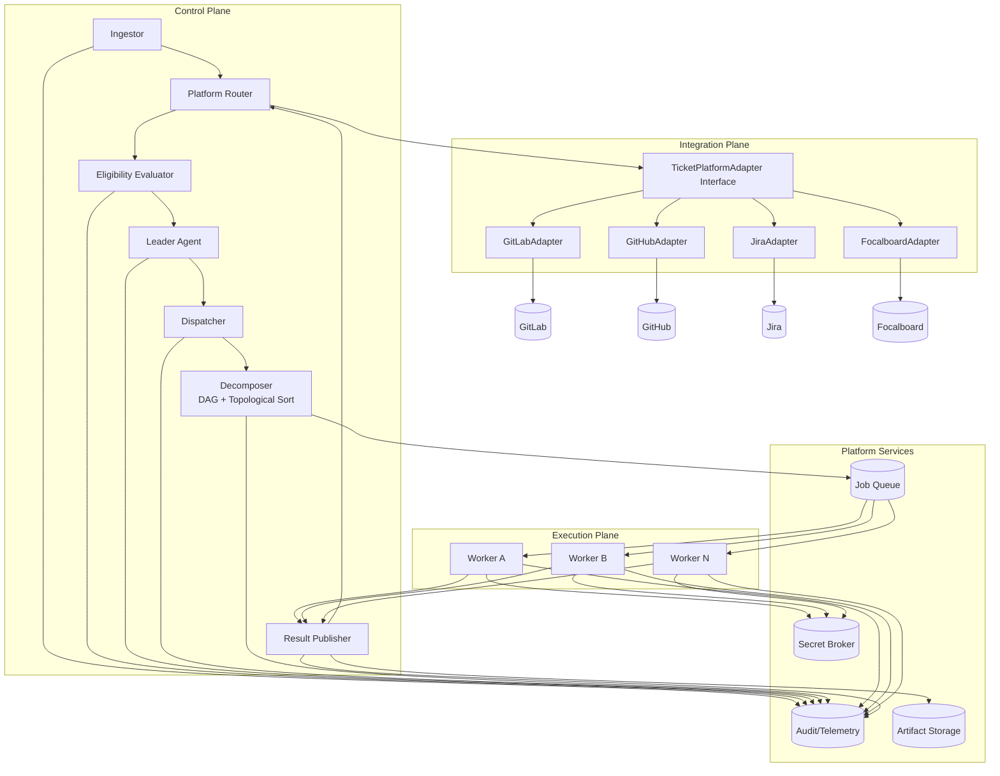
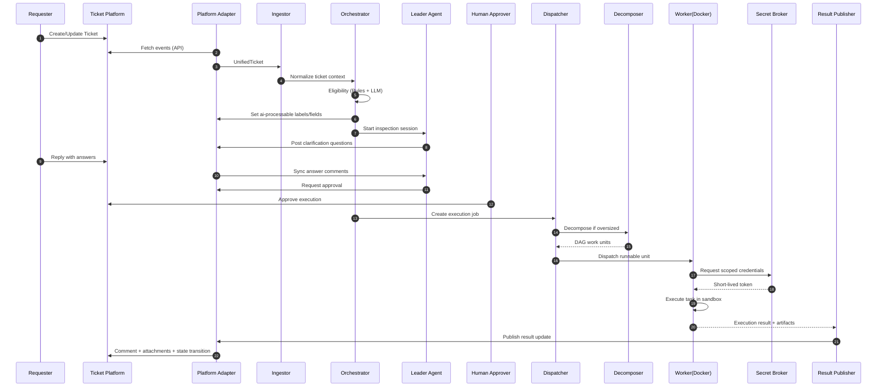
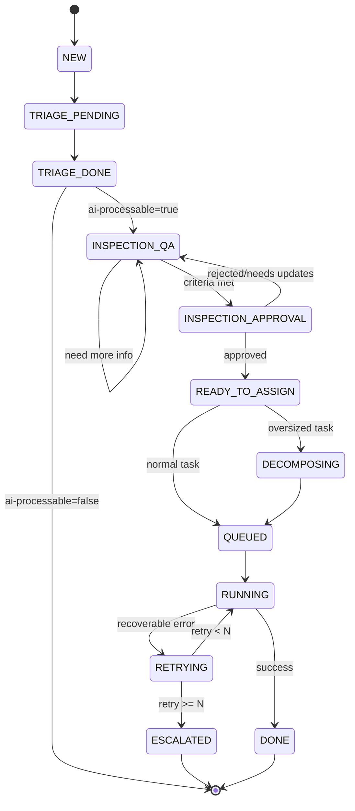
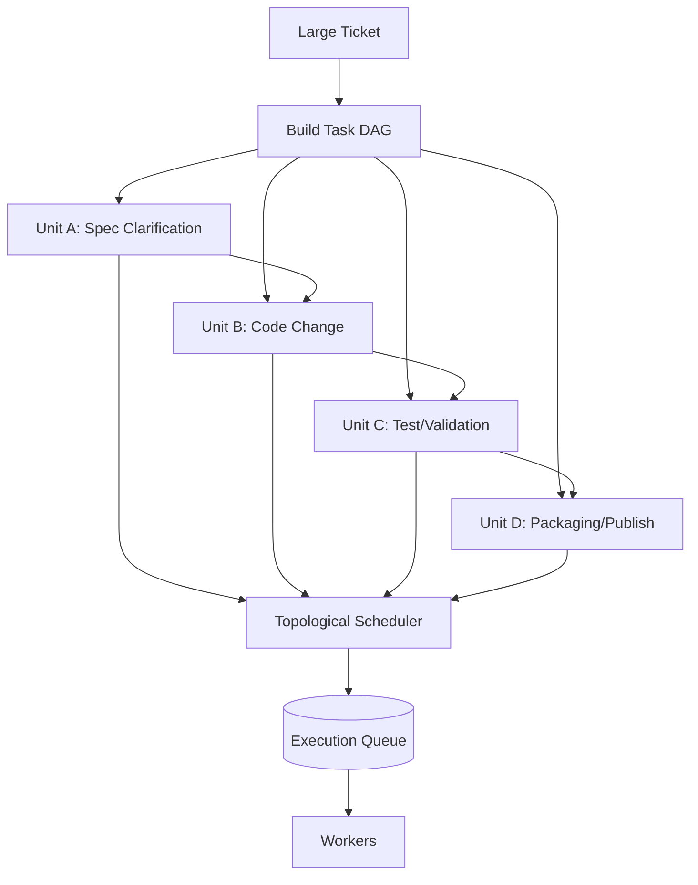
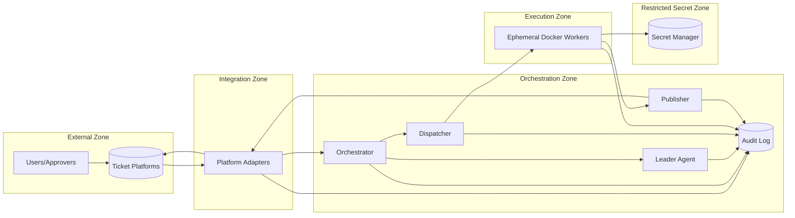

# AI Ticket Orchestration MVP Architecture (Multi-Platform)

- Version: 2.1
- Date: 2026-03-05
- Scope: Enterprise-wide ticket workflow automation MVP
- Supported Platforms: GitLab, GitHub, Jira, Focalboard

## 1. Architecture Intent
This document describes a multi-agent architecture that automates AI-processable ticket work while preserving enterprise collaboration workflows.
It defines component boundaries, execution flow, state transitions, and trust boundaries.
Platform integration contracts are standardized by [Ticket Platform Interface](./ticket-platform-interface.md).

### 1.1 At a Glance
This system keeps human-centered ticket collaboration and automates only work that AI can safely process.

Core flow:
1. Read a ticket through the ingestion pipeline (details: [AI Ticket Ingestion Architecture](./ai-ingestion-architecture.md)) and [determine AI eligibility](./ai-eligibility-criteria.md).
2. [If required information is missing](./ai-inspection-qa-guideline.md), the AI leader asks clarification questions and collects responses.
3. After approval, workers execute in [sandboxed runtime](./sandbox-runtime-architecture.md), using startup prompt rules from [Worker System Prompt Contract](./worker-system-prompt-contract.md).
4. Publish results back to the source ticket platform (comment, attachment, state update).

### 1.2 Suggested Reading Order
1. `2. System Context`
2. [AI Ticket Ingestion Architecture](./ai-ingestion-architecture.md)
3. `4. End-to-End Execution Sequence`
4. `5. Ticket State Machine`
5. `7. Trust Boundaries and Security Zones`
6. `3, 6, 8, 9, 10` for implementation and operations details

### 1.3 Terms
1. Leader Agent: controls inspection, validation, and approval requests.
2. Worker: executes concrete tasks.
3. Decomposer: breaks large tasks into DAG work units.
4. Orchestrator: central flow and state coordinator.
5. Ticket Platform Adapter: converts platform APIs into unified contract.

## 2. System Context
This diagram shows external platforms, internal control flow, and publish path.

Interpretation:
1. Users interact only through their ticket platform.
2. Worker credentials are always brokered by secret manager (see [Secret Broker Architecture](./secret-broker-architecture.md)).
3. Ingestor reads platform updates through adapters and normalizes them before orchestration (details: [AI Ticket Ingestion Architecture](./ai-ingestion-architecture.md)).
4. Results are published back to the originating platform through publisher + adapter.

Ingestion connection settings (platform type, host/base URL, auth reference, polling/webhook mode) are managed through the Ingester Admin Console, which supports multiple platform registrations, defined in [AI Ticket Ingestion Architecture](./ai-ingestion-architecture.md).

## 3. Logical Components
The architecture is split into four planes:
1. Control Plane
2. Integration Plane
3. Execution Plane
4. Platform Services

## 4. End-to-End Execution Sequence
Ingestion-specific behavior (mode selection, normalization, dedupe, and handoff checkpoints) is defined in [AI Ticket Ingestion Architecture](./ai-ingestion-architecture.md).

## 5. Ticket State Machine
The internal state machine is platform-agnostic.
Adapters map platform-native status/fields to these states.

## 6. Decomposition and Scheduling Model

## 7. Trust Boundaries and Security Zones

## 8. MVP Non-Functional Targets
1. Security: 0 unauthorized executions, 0 credential leaks.
2. Reliability: deterministic retry then escalation behavior.
3. Traceability: full audit trail for state and access events.
4. Performance: reduced median lead time for standard tasks.
5. Product KPI: >= 60% completion rate for AI-processable tasks.
6. Portability: add new platform by adapter implementation only.

## 9. Platform API Interaction Principles
The single integration contract is [Ticket Platform Interface](./ticket-platform-interface.md).

1. All reads/writes go through adapters.
2. Tokens must use least-privilege scopes per platform.
3. Unsupported capabilities must follow documented fallbacks.
4. Publishing order remains consistent: comment -> attachment -> labels/state.

## 10. Rollout Phases
1. Phase 1: Interface + GitLab adapter + state machine baseline.
2. Phase 2: Eligibility + inspection Q/A + human approval gate.
3. Phase 3: Worker sandbox + result publishing.
4. Phase 4: GitHub/Jira/Focalboard adapter rollout.
5. Phase 5: Cross-platform observability and regression suite.
