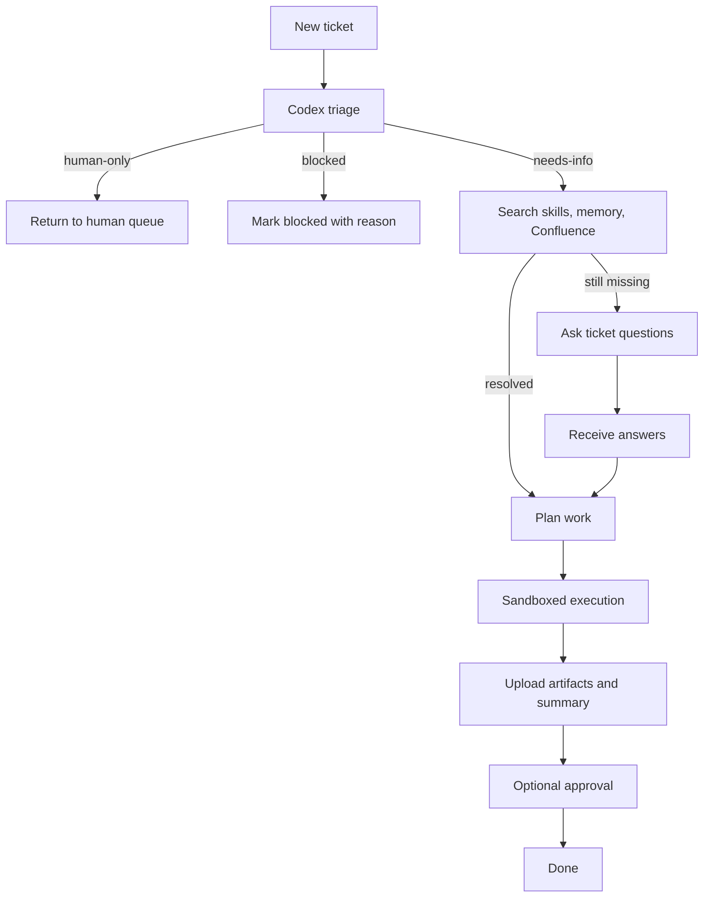

# Codex Ticket Operating Model

## 1. Executive Summary

This proposal defines a company-wide operating model where `Codex` acts as a ticket-processing digital workforce layer on top of existing teams.

The core thesis is:

- A single task agent or a small agent team can automate a task.
- That does not replace how a company actually operates through negotiation, clarification, approval, and shared visibility.
- The right abstraction is not "replace the company with agents."
- The right abstraction is "run Codex on top of the company through tickets, policy, skills, and sandboxed execution."

This model removes unnecessary `leader agent / worker agent` separation. A single `Codex` runtime handles the full loop:

1. read a ticket
2. judge whether it is feasible for AI
3. collect missing knowledge from skills, internal memory, and Confluence
4. ask follow-up questions only when unresolved
5. execute the work in a sandbox
6. update the original ticket with results

## 2. Problem Statement

Current multi-agent patterns are strong at narrow execution, but weak at company-shaped work.

- They optimize for "finish this task."
- Companies optimize for "finish this task with the right context, permissions, visibility, approval path, and traceability."
- Human organizations still define the request, own the outcome, and negotiate missing information.
- The operating problem is therefore not pure execution. It is execution under organizational control.

The proposed model keeps the company structure intact and inserts Codex as a controllable execution layer.

## 3. Why Codex

Codex is the right runtime for this model because it already provides the primitives needed for controlled ticket execution.

- `AGENTS.md`
  - repository or workspace scoped policy and operating rules
- `skills`
  - reusable task knowledge, tool instructions, and domain playbooks
- `sandbox and approvals`
  - controlled execution boundary for risky actions
- `local runtime`
  - close to code, documents, and existing developer workflows

Operational assumption:

- The company provisions Codex through approved plan-based seats or sanctioned internal runtime policy.
- The default model is not "call a high-volume API for every step."
- The unit of work is a `ticket`, not a chat session.

## 4. Target Operating Model

### 4.1 System of record

All work starts from a shared board abstraction.

- Jira
- GitLab issues
- Mattermost Boards
- Notion databases
- any other board-like system with task metadata, comments, and attachments

The board is the source of truth for status, ownership, discussion, and artifacts.

### 4.2 Single-agent lifecycle



### 4.3 Lifecycle details

#### Step 1. Ticket intake

Codex reads:

- title
- description
- acceptance criteria
- labels
- linked systems
- permissions
- attachments
- prior comments

#### Step 2. Feasibility triage

Codex assigns one of four outcomes:

- `executable`
  - enough information and permissions exist
- `needs-info`
  - likely executable after more context
- `blocked`
  - cannot proceed because permissions, dependencies, or systems are unavailable
- `human-only`
  - requires judgment or authority that should stay with a human

#### Step 3. Knowledge resolution

Before asking a human, Codex gathers context from:

1. skill instructions in `SKILL.md`
2. repository and local documentation
3. internal memory or database entries
4. Confluence search and page retrieval
5. ticket attachments and linked artifacts

This is a major design choice. Most clarification should be replaced by structured knowledge retrieval, not by immediately asking a person.

#### Step 4. Follow-up questions

If unresolved gaps remain, Codex asks concise ticket comments.

Question policy:

- ask only questions that materially change execution
- batch related questions into one comment
- include why the answer matters
- stop asking once the ticket is executable or clearly blocked

#### Step 5. Planning

Once enough information exists, Codex writes a short execution plan into the ticket.

The plan should contain:

- scope Codex will handle
- expected outputs
- systems it will touch
- approvals or credentials it depends on
- stop condition if the task expands

#### Step 6. Sandboxed execution

Codex performs the work inside a controlled environment.

Typical actions:

- clone or modify repositories
- create documents
- generate spreadsheets or slide decks
- search Confluence
- prepare reports
- upload attachments
- open or update merge requests

#### Step 7. Ticket update

Codex writes back:

- what changed
- links to artifacts
- status transition
- unresolved follow-up items
- reviewer or approver request if needed

## 5. Knowledge Resolution Strategy

The operating model depends on explicit knowledge priority.

### 5.1 Resolution order

1. `skills`
2. local repository docs and templates
3. internal memory or structured DB
4. Confluence search
5. human comment reply

### 5.2 Why this order matters

- It lowers recurring clarification cost.
- It makes ticket handling more deterministic.
- It converts tribal knowledge into reusable skill assets.
- It keeps people focused on missing business context instead of repeating operational instructions.

### 5.3 What belongs in each layer

- `skills`
  - tool usage, known workflows, checklists, domain conventions
- `local docs`
  - project architecture, contracts, scripts, repo-level instructions
- `internal memory or DB`
  - decisions, mappings, reusable facts, credential routing metadata
- `Confluence`
  - broad organizational knowledge and reference pages

## 6. Reference Ticket Contract

The ticket contract should be stable across board products.

```yaml
id: WF-1042
source:
  system: jira
  url: https://example.local/browse/WF-1042
title: Generate monthly cost report and open remediation MR
summary: Build the report, update the dashboard, and propose fixes for overspend.
status: triage
labels:
  - ai-candidate
  - finops
acceptance_criteria:
  - spreadsheet uploaded to the ticket
  - dashboard numbers updated
  - remediation MR opened
knowledge_hints:
  skills:
    - ticket-operator
    - finops-reporting
  confluence_queries:
    - monthly cost report template
    - cost anomaly remediation guide
permissions:
  git:
    repo: org/finops
    access: write
  confluence:
    spaces:
      - FINOPS
    access: read
  storage:
    location: s3://team-artifacts/finops/
    access: write
approval:
  required: true
  reviewers:
    - team-lead
artifacts: []
```

## 7. System Architecture

### 7.1 Components

- `Board Gateway`
  - normalizes Jira, GitLab, Mattermost Boards, and Notion into one ticket model
- `Codex Runtime`
  - reads tickets, triages feasibility, plans, executes, and writes back
- `Policy Layer`
  - `AGENTS.md` plus ticket-specific policy and approval rules
- `Skill Layer`
  - domain skills that encode procedures and tool usage
- `Knowledge Layer`
  - repository docs, internal memory, DB, and Confluence
- `Execution Layer`
  - sandboxed filesystem, terminal, and artifact handling
- `Audit Layer`
  - records triage result, questions, execution history, and output links

### 7.2 Design principles

- no leader-agent / worker-agent split by default
- the ticket stays the control surface
- knowledge lookup happens before human interruption
- permissions must be attached to the ticket or derivable from approved policy
- every material action must be explainable through ticket comments and logs

## 8. Security and Approval Model

Security is ticket-scoped, not session-scoped.

- each ticket must carry or resolve the permission scope it allows
- Codex must not infer access that was never granted
- sensitive systems should be fronted by a credential registry or vault policy
- blocked tickets must remain blocked until permissions are present

Recommended approval policy:

- low-risk documentation or reporting
  - auto-complete allowed
- code, production config, or external communication
  - explicit reviewer or approver required
- sensitive data access
  - explicit approval and audited credential grant required

## 9. Comment Protocol

Use predictable ticket comments so humans can scan status quickly.

- `[triage]`
  - feasibility result and why
- `[questions]`
  - missing information needed to continue
- `[plan]`
  - short plan with scope and outputs
- `[result]`
  - completed actions, artifacts, and next steps
- `[blocked]`
  - why execution cannot continue

Example:

```text
[questions]
I can complete this ticket after two missing items are clarified:
1. Which production dashboard should receive the updated numbers?
2. Should the remediation MR target the March 2026 branch or main?
These answers change both the output destination and the branch strategy.
```

## 10. Implementation Backlog

### Phase 1. Pilot

- define the common ticket contract
- choose one board source and one Confluence space
- create a repository-level `AGENTS.md`
- create the first 3 to 5 operational skills
- run a small ticket class such as documentation, reporting, or low-risk code fixes

### Phase 2. Expansion

- add more board connectors
- introduce credential routing and artifact storage rules
- formalize approval policies by work type
- add KPI dashboards
- expand skill coverage by domain

### Phase 3. Company operating layer

- standardize ticket labels and AI eligibility rules
- add memory or DB-backed reusable fact storage
- enable cross-repository ticket execution
- formalize audit retention and compliance review
- evaluate external productization after internal saturation

## 11. KPI Framework

Track the operating model through a small set of metrics.

- ticket auto-triage rate
- human question rate per ticket
- execution success rate
- median cycle time
- rework rate
- approval turnaround time
- artifact delivery rate
- cost per completed ticket

## 12. Example Use Cases

### 12.1 Code task

- read the issue
- gather repo instructions from `AGENTS.md`
- use the relevant skill
- inspect local code and Confluence notes
- ask only unresolved branch or rollout questions
- patch code in a sandbox
- run checks
- open the MR
- update the ticket with the MR link

### 12.2 Non-code task

- read the request for spreadsheet or deck generation
- retrieve the reporting skill and template
- search Confluence for the latest reporting standard
- generate the artifact
- upload the file to the ticket
- leave a concise result summary

## 13. Final Position

This proposal does not claim that Codex replaces the company.

It claims something narrower and more useful:

- people keep the organization, negotiation, and accountability
- Codex becomes the operational execution layer
- the ticket becomes the shared control surface
- skills and knowledge replace most repetitive clarification
- approvals and sandboxing keep the system governable

That is a more realistic path to company-scale AI operations than role-splitting agents into an artificial hierarchy.
