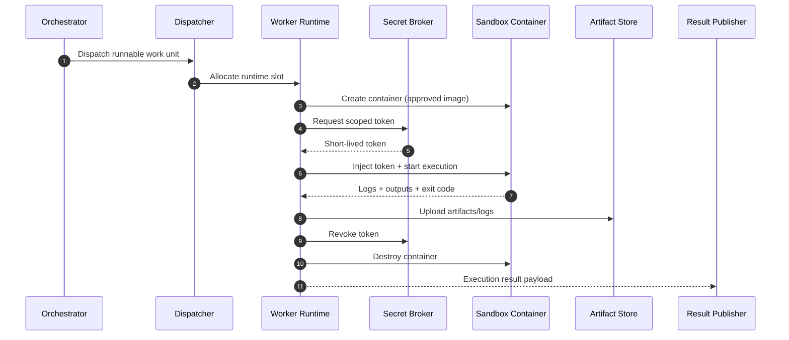

# Sandbox Runtime Architecture

- Version: 1.0
- Date: 2026-03-05
- Scope: Worker execution sandbox for multi-platform ticket orchestration

## 1. Purpose
This document defines how the worker sandbox is provisioned, secured, observed, and terminated.
The goal is deterministic execution with strong isolation, least-privilege access, and full auditability.

## 2. Runtime Model
Each work unit runs in an ephemeral Docker container created per execution attempt.

Execution lifecycle:
1. Orchestrator submits a runnable work unit to Dispatcher.
2. Dispatcher allocates a Worker Runtime slot.
3. Runtime creates an isolated container from an approved base image.
4. Secret Broker injects short-lived scoped credentials.
5. Worker executes task steps and writes outputs to mounted workspace/artifact paths.
6. Runtime collects logs, artifacts, and exit status.
7. Runtime destroys container and revokes credentials.
8. Publisher posts results through the selected platform adapter.

## 3. Isolation Boundaries
### 3.1 Process and Host Isolation
1. One work unit per container.
2. No privileged mode.
3. Non-root user inside container.
4. Strict CPU/memory/pid limits.

### 3.2 Filesystem Isolation
1. Read-only base image layer.
2. Ephemeral writable workspace mount.
3. Dedicated artifact output directory.
4. No host filesystem write outside allowed mounts.

### 3.3 Network Isolation
1. Default deny egress.
2. Allowlist outbound destinations per work profile.
3. Block direct access to internal metadata services.
4. DNS restricted to approved resolvers.

## 4. Secret and Credential Flow
For full broker internals (role, storage model, issuance/revocation APIs), see [Secret Broker Architecture](./secret-broker-architecture.md).

1. Ticket stores only `grant_ref_ids`.
2. Worker requests execution-scoped credentials from Secret Broker.
3. Secret Broker returns short-lived token with minimal permissions.
4. Token is injected as in-memory env/volume, never persisted in artifacts.
5. Runtime must provide platform-specific variable names according to [Worker System Prompt Contract](./worker-system-prompt-contract.md).
6. Token is revoked at completion, timeout, or forced termination.

### 4.1 `grant_ref_ids` Registration Ownership
1. `grant_ref_ids` are registered in the central secret manager, not in the ticket platform.
2. Registration owner is a platform/security administrator (or delegated DevOps operator).
3. Ticket requesters and normal contributors cannot create or edit secret grants directly.

### 4.2 `grant_ref_ids` Registration Timing
1. Grants are pre-registered before execution windows for known integration scopes.
2. During inspection/approval, the orchestrator selects allowed grants and writes only reference IDs to ticket metadata.
3. If no approved grant exists for required scope, execution is blocked and escalated.

### 4.3 Minimal Grant Record
Each grant record should include:
1. `grant_ref`
2. `platform`
3. `workspaceId`
4. `allowedScopes`
5. `owner`
6. `expiresAt`
7. `status` (`active|revoked`)

## 5. Execution Policy
1. Execution timeout per work unit (hard timeout).
2. Optional idle timeout for stalled command streams.
3. Retryable vs non-retryable failure classification.
4. Policy-driven command restrictions for high-risk actions.

## 6. Artifact and Log Handling
1. Capture stdout/stderr and structured step logs.
2. Store artifacts in controlled storage with immutable references.
3. Redact sensitive patterns before publishing logs.
4. Attach only sanitized outputs to ticket platforms.

## 7. Observability and Audit
Mandatory runtime events:
1. `sandbox.created`
2. `credentials.issued`
3. `execution.started`
4. `execution.step`
5. `execution.finished`
6. `credentials.revoked`
7. `sandbox.destroyed`

Each event must include:
1. `platform`
2. `workspaceId`
3. `ticketId`
4. `workUnitId`
5. `workerId`
6. `timestamp`
7. `correlationId`

## 8. Failure Modes and Handling
1. Image pull failure -> retry with backoff, then escalate.
2. Secret issue failure -> immediate escalation.
3. Policy violation (blocked command/network) -> fail fast and escalate.
4. Timeout/OOM -> classify as runtime failure and apply retry policy.
5. Publish failure after successful execution -> preserve artifacts and retry publish path separately.

## 9. Mermaid: Sandbox Lifecycle

## 10. Minimum Security Checklist
1. Container runs as non-root.
2. Privileged mode disabled.
3. Egress policy enforced.
4. Token TTL enforced.
5. Secret value redaction verified.
6. Audit events complete for each execution.
7. Sandbox destroyed on both success and failure paths.

## 11. Operational SLOs (Initial)
1. Sandbox provisioning success rate >= 99%.
2. Token revoke success rate = 100%.
3. Runtime timeout false-positive rate < 2%.
4. Log redaction miss rate = 0 in sampled audits.
