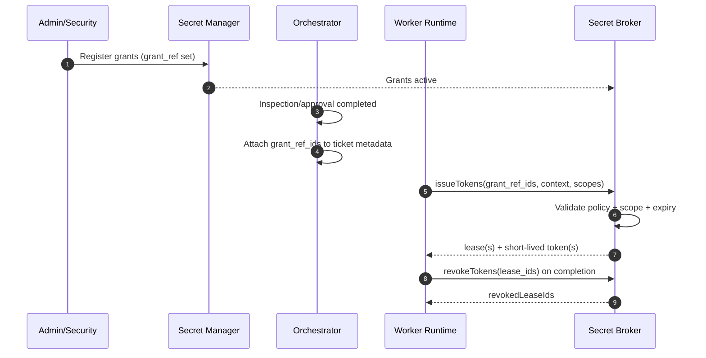
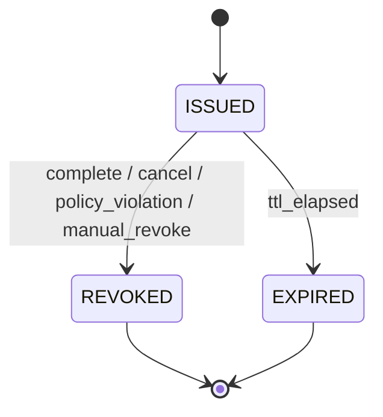

# Secret Broker Architecture

- Version: 1.1
- Date: 2026-03-05
- Scope: Credential reference resolution, token issuance, and token revocation for worker runtime

## 1. Purpose
The Secret Broker is the control point between ticket metadata (`grant_ref_ids`) and real credentials.
Workers never receive long-lived secrets directly; they only receive short-lived scoped runtime tokens.

## 2. Canonical Key Convention
1. Ticket-level canonical key is `grant_ref_ids: string[]`.
2. Single-grant cases still use array form (length = 1).
3. Legacy singular metadata keys are deprecated.

## 3. Core Role
1. Resolve credential references from `grant_ref_ids`.
2. Validate execution context (platform, workspace, ticket, work unit, policy).
3. Issue short-lived access tokens with least privilege.
4. Revoke tokens on completion, timeout, cancellation, or policy violation.
5. Emit audit events for registration, issuance, usage, and revocation.

## 4. Responsibility Boundary
### 4.1 In Scope
1. Grant metadata lookup and validation.
2. Runtime token minting, TTL enforcement, and revocation.
3. Policy checks (scope, owner, environment, time window).
4. Broker-side audit event generation.

### 4.2 Out of Scope
1. Ticket ingestion and classification.
2. Business logic execution inside workers.
3. Ticket platform API operations (handled by platform adapters).

## 5. Data Storage Model
The broker uses encrypted storage in the central secret manager with three logical entities.

### 5.1 Grant Registry (`grant_registry`)
Stores pre-registered grant references created by admin/security roles.

Fields:
1. `grant_ref` (PK)
2. `platform`
3. `workspace_id`
4. `allowed_scopes[]`
5. `owner_principal`
6. `approval_policy_id`
7. `status` (`active|revoked|expired`)
8. `expires_at`
9. `created_at`
10. `updated_at`

### 5.2 Token Lease (`token_lease`)
Stores runtime-issued short-lived tokens and lease state.

Fields:
1. `lease_id` (PK)
2. `grant_ref` (FK)
3. `ticket_id`
4. `work_unit_id`
5. `worker_id`
6. `issued_scopes[]`
7. `issued_at`
8. `expires_at`
9. `revoked_at` (nullable)
10. `revoke_reason` (nullable)
11. `status` (`issued|revoked|expired`)

### 5.3 Audit Event (`secret_audit_event`)
Immutable event stream for compliance and incident response.

Fields:
1. `event_id` (PK)
2. `event_type`
3. `grant_ref`
4. `lease_id` (nullable)
5. `platform`
6. `workspace_id`
7. `ticket_id`
8. `work_unit_id`
9. `actor` (`orchestrator|worker|admin|system`)
10. `timestamp`
11. `result` (`success|denied|error`)
12. `reason_code` (nullable)

## 6. Registration Lifecycle (`grant_ref_ids`)
1. Platform/security admin registers grant metadata in secret manager.
2. Registration is checked against policy (owner, scope, expiry, environment).
3. Broker marks grant as `active` once approved.
4. Orchestrator writes selected references to ticket metadata as `grant_ref_ids` after inspection/approval.
5. Runtime can use only `active` and non-expired grant references.

## 7. Issuance and Revocation Flow
### 7.1 Issuance Preconditions
1. Ticket is approved for execution.
2. Every reference in `grant_ref_ids` exists and is `active`.
3. Requested scopes are subset of each grant's `allowed_scopes`.
4. Environment policy and execution window are valid.

### 7.2 Issuance Steps
1. Worker sends issue request with execution context + `grant_ref_ids`.
2. Broker validates grants and policy.
3. Broker mints short-lived token leases (one lease per grant reference).
4. Broker records `credentials.issued` audit events.
5. Worker receives tokens via secure channel (memory/env/ephemeral mount only).
6. Broker response is consumed by runtime that maps tokens to platform env names defined in [Worker System Prompt Contract](./worker-system-prompt-contract.md).

### 7.3 Revocation Triggers
1. Work unit completed.
2. Runtime timeout or cancellation.
3. Policy violation detected.
4. Manual emergency revoke by admin.
5. Incident response lockout.

### 7.4 Revocation Steps
1. Runtime/control plane calls revoke endpoint with `lease_id` or `ticket_id + work_unit_id`.
2. Broker invalidates active leases and updates status.
3. Broker records `credentials.revoked` events with reason.
4. Any further token use is denied.

## 8. Multi-Grant Behavior
1. `grant_ref_ids` is always array-based.
2. Broker validates each reference independently.
3. Worker receives segmented leases for least-privilege isolation.
4. If one required grant fails validation, dependent work units are blocked and escalated.

## 9. API Contract (Logical)
```ts
interface SecretBrokerApi {
  registerGrants(input: {
    grants: {
      grantRef: string;
      platform: string;
      workspaceId: string;
      allowedScopes: string[];
      ownerPrincipal: string;
      expiresAt: string;
      approvalPolicyId: string;
    }[];
  }): Promise<{ accepted: string[]; rejected: { grantRef: string; reason: string }[] }>;

  resolveGrants(input: {
    grantRefIds: string[];
    platform: string;
    workspaceId: string;
  }): Promise<{
    resolved: { grantRef: string; status: 'active' | 'revoked' | 'expired'; allowedScopes: string[] }[];
  }>;

  issueTokens(input: {
    grantRefIds: string[];
    ticketId: string;
    workUnitId: string;
    workerId: string;
    requestedScopes: string[];
    ttlSeconds: number;
  }): Promise<{ leases: { leaseId: string; grantRef: string; token: string; expiresAt: string }[] }>;

  revokeTokens(input: {
    leaseIds?: string[];
    ticketId?: string;
    workUnitId?: string;
    reason: string;
  }): Promise<{ revokedLeaseIds: string[] }>;
}
```

## 10. Mermaid: End-to-End Credential Flow


## 11. Mermaid: Lease State Machine


## 12. Security Controls
1. No raw secret values in tickets, logs, or artifacts.
2. Server-side TTL and scope minimization are mandatory.
3. Deny-by-default on unknown grants or scope escalation attempts.
4. Emergency global revoke is available for incident response.
5. Audit events are immutable and tamper-evident.

## 13. Failure Modes and Responses
1. `GRANT_NOT_FOUND`: deny issuance and escalate.
2. `GRANT_EXPIRED`: deny issuance and request renewal.
3. `SCOPE_NOT_ALLOWED`: deny issuance and log policy violation.
4. `BROKER_UNAVAILABLE`: fail safe (no token), retry with backoff, then escalate.
5. `REVOKE_FAILED`: quarantine outputs and trigger security alert.

## 14. Operational Metrics
1. Token issuance success rate.
2. Median issuance latency.
3. Revoke success rate.
4. Denied issuance rate by reason code.
5. Scope escalation attempt count.
6. Lease expiration without explicit revoke count.
