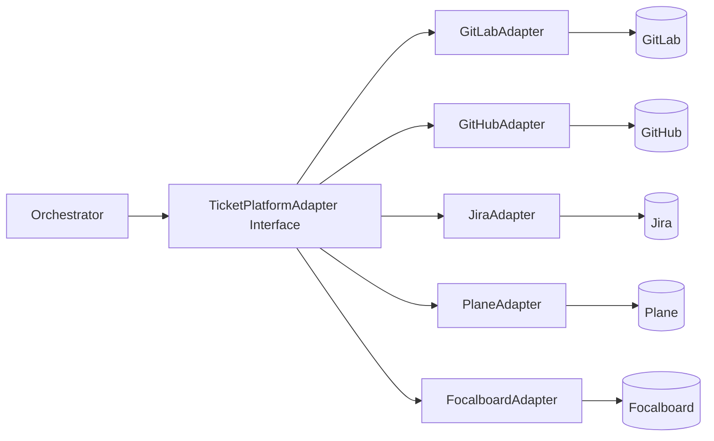

# Ticket Platform Interface Specification (Multi-Board)

- Version: 1.1
- Date: 2026-03-05
- Scope: Adapter contract for GitLab, GitHub, Jira, Plane, and Focalboard

## 1. Purpose
This interface removes platform lock-in by abstracting ticket, comment, status, and attachment operations behind a common contract.
Any new board system can be integrated by implementing an adapter without changing orchestration core logic.

## 2. Core Principles
1. Define platform-agnostic domain models first; map platform APIs in adapter layer.
2. Orchestrator depends only on `TicketPlatformAdapter`.
3. Expose platform-specific differences through `capabilities`.
4. Keep a common internal state machine; perform platform-specific status mapping in adapters.

## 3. Unified Domain Model
```ts
export type PlatformType = 'gitlab' | 'github' | 'jira' | 'plane' | 'focalboard';

export type UnifiedTicket = {
  platform: PlatformType;
  workspaceId: string;
  boardId?: string;
  ticketId: string;
  title: string;
  description: string;
  labels: string[];
  assignees: string[];
  status: string;
  priority?: string;
  dueDate?: string;
  links?: string[];
};

export type UnifiedComment = {
  commentId: string;
  author: string;
  body: string;
  createdAt: string;
};

export type AttachmentRef = {
  fileName: string;
  mimeType: string;
  url: string;
};

export type PlatformCapabilities = {
  supportsLabels: boolean;
  supportsAttachments: boolean;
  supportsStateTransition: boolean;
  supportsThreadedComments: boolean;
  supportsCustomFields: boolean;
};
```

## 4. TicketPlatformAdapter Contract
```ts
export interface TicketPlatformAdapter {
  platform(): PlatformType;
  capabilities(): PlatformCapabilities;

  listUpdatedTickets(input: {
    workspaceId: string;
    boardId?: string;
    updatedSince: string;
    limit: number;
  }): Promise<UnifiedTicket[]>;

  getTicket(input: {
    workspaceId: string;
    boardId?: string;
    ticketId: string;
  }): Promise<UnifiedTicket>;

  listComments(input: {
    workspaceId: string;
    boardId?: string;
    ticketId: string;
  }): Promise<UnifiedComment[]>;

  postComment(input: {
    workspaceId: string;
    boardId?: string;
    ticketId: string;
    body: string;
  }): Promise<{ commentId: string }>;

  addAttachments(input: {
    workspaceId: string;
    boardId?: string;
    ticketId: string;
    files: { path: string; fileName: string }[];
  }): Promise<AttachmentRef[]>;

  updateLabels(input: {
    workspaceId: string;
    boardId?: string;
    ticketId: string;
    add?: string[];
    remove?: string[];
  }): Promise<void>;

  transitionState(input: {
    workspaceId: string;
    boardId?: string;
    ticketId: string;
    targetState: string;
  }): Promise<void>;

  upsertCustomFields?(input: {
    workspaceId: string;
    boardId?: string;
    ticketId: string;
    fields: Record<string, string | number | boolean>;
  }): Promise<void>;
}
```

## 5. Platform Mapping Guide
### 5.1 GitLab
1. Ticket: Issue (`project_id + issue_iid`)
2. Comment: Notes
3. Labels: Issue labels
4. State: `state_event` + workflow labels
5. Attachment: Upload API + note reference

### 5.2 GitHub
1. Ticket: Issue (`repo + issue_number`)
2. Comment: Issue comments
3. Labels: Labels
4. State: `open/closed`
5. Attachment: external object storage link in comment when required

### 5.3 Jira
1. Ticket: Issue (`project + issue_key`)
2. Comment: Comments
3. Labels/Fields: Labels + custom fields
4. State: Workflow transition ID
5. Attachment: Attachments API

### 5.4 Focalboard
1. Ticket: Card (`board + card_id`)
2. Comment: Card comments
3. Labels: card properties/tags
4. State: column/stage move
5. Attachment: card attachment feature

### 5.5 Plane
1. Ticket: Issue (`workspace/project + issue_id`)
2. Comment: Issue comments/activities
3. Labels: labels/modules
4. State: state/group transition
5. Attachment: issue attachment API

## 6. Capability Fallback Rules
1. If `supportsAttachments=false`, upload file to external storage and post link comment.
2. If `supportsLabels=false`, use custom field or comment tags.
3. If `supportsStateTransition=false`, map state via labels/fields.
4. If `supportsThreadedComments=false`, include context tokens in a flat comment stream.

## 7. Authentication and Access
1. Use platform service account or app token.
2. Store tokens in central secret manager by `platform/workspace` key.
3. Inject only short-lived scoped tokens into workers.
4. `grant_ref_ids` registration is admin-owned (platform/security admins), while runtime consumes reference IDs only (details: [Secret Broker Architecture](./secret-broker-architecture.md)).
5. Worker startup prompt must declare canonical platform env var names (see [Worker System Prompt Contract](./worker-system-prompt-contract.md)).
6. Log every platform action with `platform + workspaceId + ticketId + action`.

## 8. Error Model
Common error codes:
1. `PLATFORM_AUTH_FAILED`
2. `PLATFORM_RATE_LIMITED`
3. `PLATFORM_NOT_FOUND`
4. `PLATFORM_VALIDATION_ERROR`
5. `PLATFORM_TRANSIENT_ERROR`

Retry policy:
1. Auto-retry only `RATE_LIMITED` and `TRANSIENT_ERROR`.
2. Escalate immediately for `AUTH_FAILED` and `VALIDATION_ERROR`.

## 9. Integration Flow


## 10. Rollout Sequence
1. Step 1: Interface + GitLab adapter baseline.
2. Step 2: Add GitHub adapter.
3. Step 3: Add Jira adapter.
4. Step 4: Add Plane adapter.
5. Step 5: Add Focalboard adapter.
6. Step 6: Consolidate cross-platform regression tests and observability.
